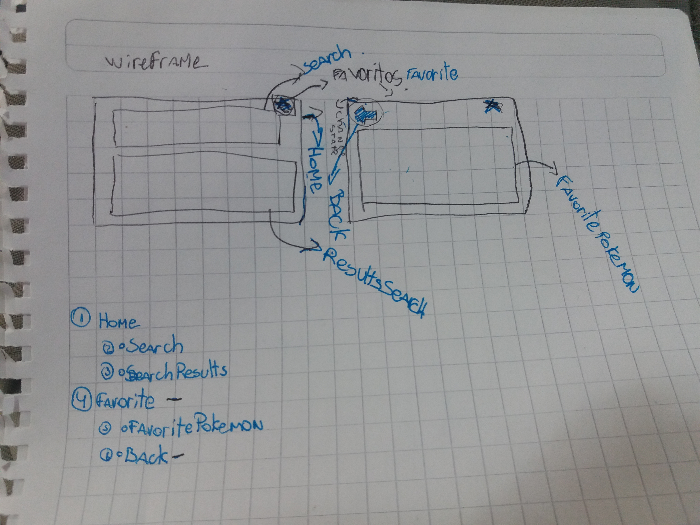

## Pokemon React

Creado con Api pokemon TCG y React.

### Wireframe del proyecto

### Uso de React

These instructions will get you a copy of the project up and running on your local machine for development and testing purposes. See deployment for notes on how to deploy the project on a live system.

## Ambiente de desarrollo

Se utilizaron las siguientes herramientas:

* [Material UI](http://www.material-ui.com/#/) - React component que implementa el Framework de Google Material Design.
* [React flexbox grid](https://roylee0704.github.io/react-flexbox-grid/) - Uso de grillas para vista web y repsonsive.
* [React Icons](https://gorangajic.github.io/react-icons/) - Iconos para react.
* [React](https://reactjs.org/tutorial/tutorial.html) -Este proyecto esta realizado en react js contiene 5 componentes.
* [jquery] (https://jquery.com/) - Uso para consultar Api
 

## Autoras

* **Nadia** - [@Nadia](https://github.com/NadiaMorales)
* **Kesly** - [@Kesly](https://github.com/keslymartinez)
* **Josefina** - [@Josefina](https://github.com/MrsPepa)